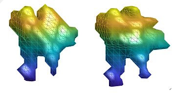

##  *基于里奇流的网络聚类和社区检测*


>Left is original image ，right is new results

### Introdution
This project is based on [professor Luo's work](https://www.nature.com/articles/s41598-019-46380-9)，
it mainly applies ricci flow on community decetion, deceting each compact community from a complex network. Comparing previous methodes, both the robustness and accuracy are improved. 

This repository introduces how to implement it.

Ossicles are the smallest bones in the human body, its interior is compact and it rare connect with other organs of our body. In this case, it can be sees as a community of a complex network when we scan our body as a mesh. Searching for ossicles on our body can be transforms community decetion. 

听小骨是人体中最小的骨头，而且在人体中属于相对独立的区域，内部比较紧密，与其他的组织联系较少，由此我们可以把听小骨看作是一个社区。所以我们把应用罗老师的算法应用图像上面，通过这种社区检测的算法，实现在图像上的听小骨的分割。


这个仓库主要是介绍整个代码的实现流程。

### Install

You need to install matlab 2017 or higher version and python3 firstly, and  download it..

下载整个代码，代码中包含matlab和python的代码，所以首先需要安装matlab 2017b及其 以上版本和python3
。
```bash
git clone --recursive https://github.com/tanghui-cslt/community-detection.git
```
#### Method 1

Download and install [GraphRicciCurvature](https://github.com/saibalmars/GraphRicciCurvature.git)

This methos is very easy, but it will have different issuses when authors update it, so I will give another method to install it.

方法一比较简单，但是可能会由于作者更新版本的原因，可能会导致各种问题。所以给出手动安装的方法。
#### Method 2 ：manual installation
versions of libraries that we will used：
```bash
python     (version=3.6.5)
cvxpy      (version=1.0.31)
networkkit (version=6.0)
networkx   (version=2.1)
pot        (version=20.1)
numpy 
pandas
cython
```

### Start

There are two auditory ossicles in the human body, in this projece, I take the left one as an example.

听小骨在人体中有两块，以下以左边的听小骨为例。 在本代码中，可以直接从第二步开始。

1.  Step 1 :

In `src/` directory，in matlab  :
```bash
step2_compare_region.m ，
``` 
Assgining a specific area including ossicle.

选定一个特定的包含听小骨的区域。

2.  Step2 : 

In `src/` directory，in python :
```bash

python step3_read_new.py

```

Esatablishing mesh, and save as .gml file.

 建立网格，并保存为gml文件。

3.  Step3：

In `src/GraphRicciCurvature` directory, in python :
```bash

python step4_grid.py num orient

```
Where the first parameter is numbe, which ranges from 1 to 18; the second parameter can be set left or right, for example.

其中num为1-18中的一个数字，orientation为left或right，例如：
```bash

python step4_grid.py 1 left

```
By utilizing ricci flow algorithm, it can get several different possible results.

利用ricci流算法，从上一步得到的数据中得到几个待选的分割的听小骨数据。

4.  Step4：

In `src/GraphRicciCurvature` directory, in python  :
```bash
step5_subgraph.py 
```
Select the best result as the final result.

从待选的数据中寻找最合适的数据，作为最终结果。


5. Step5：
In `src/` directory, in matlab :
```bash
step6_show_results.m
```


### Reference

Ni, CC., Lin, YY., Luo, F. et al. Community Detection on Networks with Ricci Flow. Sci Rep 9, 9984 (2019). https://doi.org/10.1038/s41598-019-46380-9

